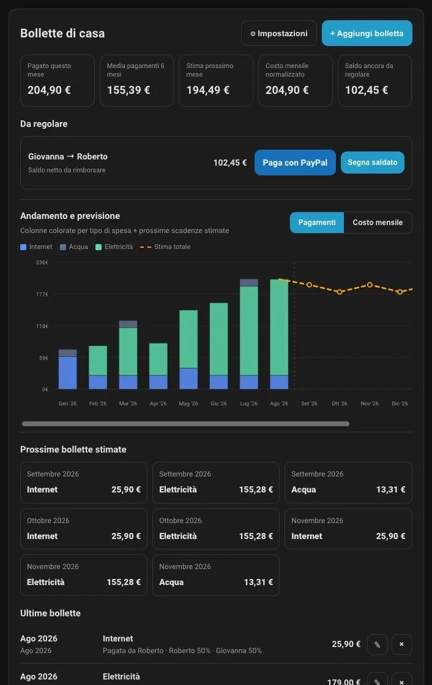
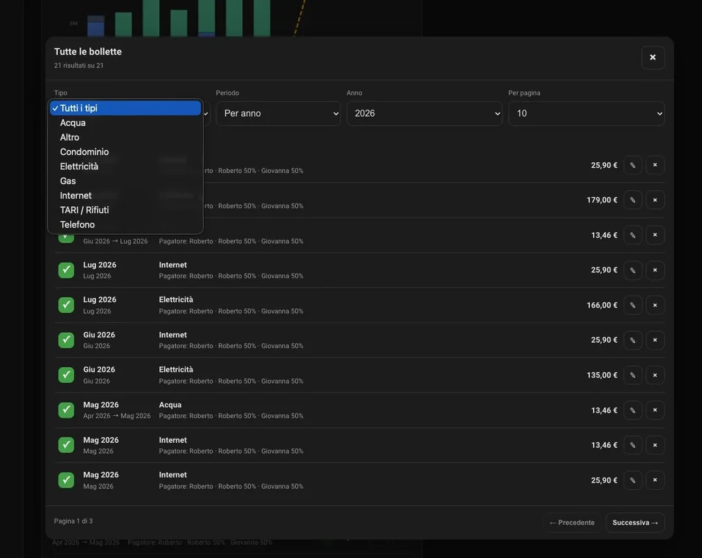
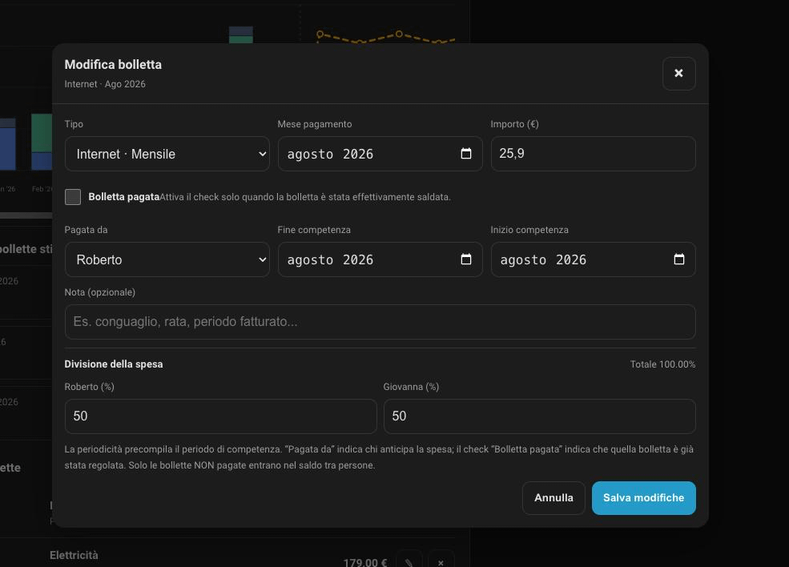

<p align="center">
  
</p>

<h1 align="center">Billy — Home Assistant Bill Tracker</h1>

<p align="center">
  Track household bills, recurring expenses, forecasts and shared costs directly in Home Assistant.
</p>

Billy is a HACS custom integration for keeping a persistent history of household bills directly in Home Assistant. It supports recurring bills, competence periods, normalized monthly costs, forecasts, bill splitting between multiple payers, utility consumption tracking and provider/contract savings estimates.

## Screenshots

### Dashboard

<p align="center">
  
</p>

### Complete bill history

<p align="center">
  
</p>

### Edit a bill

<p align="center">
  
</p>

## v0.5.0 features

- New **Import / Export** dialog with CSV import, CSV/Excel export and PDF reports.
- Export can be filtered by bill type, status and month range; PDF reports can include Payments, normalized monthly cost, or both trends.
- CSV import supports Billy round-trip exports, a downloadable template, duplicate-ID protection, and optional creation of missing bill types/payers.
- **All bills** can be filtered by payment status: **All**, **Unpaid** or **Paid**, alongside the existing type and time filters.
- Optional **payment date** and **due date** on every bill, visible in the dashboard and full history.
- Optional **provider/company**, **contract/plan** and **consumption** on each bill. Built-in Electricity uses `kWh`; Gas and Water use `m³`, and every bill type can define a custom consumption unit plus a default provider/company and contract/plan for new bills.
- New **provider/contract savings estimate**: when the provider or plan changes, Billy compares the old and new cost per consumption unit and estimates what the new usage would have cost under the previous contract. This separates tariff savings from lower/higher consumption.
- Currency is no longer hard-coded to EUR: Billy uses the currency configured in Home Assistant across the card, monetary sensor, exports, reports and PayPal.Me amounts.
- The dashboard bill list now shows only the **current month** and can be shown/hidden to keep the card compact.
- Fixed the bill-type **default payer** selector so configured payers are always selectable, with an explicit “None” option.
- Keeps the v0.4.6 reliable card-picker bootstrap for clean installs.

- **Bollette da pagare** sums only unpaid bills; paid bills are excluded from this balance. Split reimbursements between payers are tracked separately.

### Import and export

Use **Import / Export** from the card header. Billy can import CSV files and export a selected billing-month range in **CSV**, **Excel (.xlsx)** or **PDF**. Exports can also be limited to one bill type and to paid/unpaid bills only.

CSV is designed for round-trip migrations and includes bill type, recurrence, amount/currency, provider, contract, consumption/unit, billing month, paid status, exact payment/due dates, competence period, payer, split and notes. A sample CSV template can be downloaded directly from the dialog. Existing expense IDs are skipped on re-import to avoid accidental duplicates. Missing bill types and payer profiles can be created automatically if desired.

Excel exports contain a detailed **Bills** sheet and a **Monthly summary** sheet. PDF reports include totals, paid/unpaid KPIs, category breakdown, bill detail pages and a selectable trend view: **Payments**, **Normalized monthly cost**, or both. All files are generated locally inside Home Assistant/Billy; no cloud export service is used.

### Complete bill history

The dashboard keeps a compact **current-month bills** section with a show/hide button and a **Tutte le bollette** button. The full history opens in a paginated modal and can be filtered by bill type, payment status (**All / Unpaid / Paid**), by a single year, or by an arbitrary month/year range. Every row has an interactive checkmark to mark the bill paid or unpaid without opening the edit form.

### Bills and forecasts

- Add, edit and delete bills from a Lovelace card.
- Edit bills in a modal without leaving the current all-bills filter.
- Payment month and separate competence period.
- Optional exact payment date and due/expiration date for each bill.
- Persistent storage through Home Assistant `Store` (`.storage`), independent from Recorder retention.
- Recurrences: monthly, bimonthly, quarterly, every 4 months, every 6 months and yearly.
- Category-aware forecast based on each bill type's recurrence and recent amounts.
- **Payments** and **Monthly cost** chart modes.
- Stacked monthly bars: each bill type has its own color, so the visual impact of each expense is immediately visible.

### Consumption and contract savings

Each bill can optionally store a **provider/company**, **contract/plan** and a **consumption** value. The unit belongs to the bill type and is configured from **Settings → Devices & services → Bill Tracker → Configure**. The same bill-type settings can also define the current/default provider and contract, so new bills are prefilled while old bills keep their historical provider/contract snapshot. Billy ships with `kWh` for Electricity and `m³` for Gas and Water; any bill type can use a custom unit.

When Billy detects a change from one provider/contract to another inside the same bill type, it compares the latest contiguous contract period with the previous one. If both periods contain consumption data, Billy calculates the weighted cost per unit and estimates the saving using the **new period's actual consumption** at the **old unit price**. This means a lower bill caused only by lower consumption is not incorrectly reported as tariff savings.

Example: if an electricity contract moves from Company X to Company Y, Billy can show the old/new cost per kWh, average bill, average consumption, consumption change and estimated saving (or increase) at equivalent usage. Provider, contract and consumption are optional, so normal bills continue to work exactly as before.

### Currency

Billy uses the currency configured in **Home Assistant General settings** instead of assuming EUR. Dashboard totals, the monetary sensor, CSV/XLSX/PDF exports and generated PayPal.Me amount links all use that currency. Billy currently treats one Billy installation as one accounting currency; CSV imports declaring a different currency are rejected instead of mixing incomparable totals.

### Split bills

Manage payers from:

**Settings → Devices & services → Bill Tracker → Configure**

For each payer you can save:

- name;
- default split share;
- PayPal.Me username or full link;
- active/disabled state.

The shares act as weights and are normalized to 100% for new bills. For example, two active payers with shares `50` and `50` get a 50/50 split; `70` and `30` gives a 70/30 split.

For each bill type you can also choose a **default payer**. The selector lists all configured payers and includes an explicit **None** option. When adding a bill, Billy preselects the configured payer and the default split, but both can be overridden on the individual bill.

Billy calculates the outstanding split balance from **unpaid bills only**. For each unpaid bill, the configured payer is the person who advanced the bill and each other participant owes their configured share. Opposite-direction bills between the same two people are netted together. Paid bills never contribute to the current balance.

When the creditor has PayPal.Me configured, the dashboard shows **Pay with PayPal** and opens PayPal.Me with the exact outstanding amount in the Home Assistant configured currency already filled in. After the external payment, use **Segna saldato**. Billy then marks every unpaid bill included in that displayed balance as paid, so their checkmarks update and the balance becomes zero.

Settlement history stores the linked bill IDs. Reversing a settlement reopens those linked bills as unpaid.


### Payment status

Every bill has an explicit **Paid** checkbox. The configured payer and the payment status are independent: selecting a payer does not automatically mark the bill as paid. New bills are unpaid by default, and older databases migrate missing payment status as unpaid. **Only unpaid bills contribute to the outstanding split balance**; marking a bill paid removes it from that balance. Paid entries show a checkmark in recent and complete-history lists. The Payments chart continues to show bills marked paid.

## HACS installation

1. Open **HACS**.
2. Open **Custom repositories**.
3. Add `https://github.com/robin994/billy` as an **Integration**.
4. Install Billy / Bill Tracker.
5. Restart Home Assistant.
6. Open **Settings → Devices & services → Add integration**.
7. Search for **Bill Tracker** and add it.
8. Hard-refresh the Home Assistant frontend after the first installation/update if the card is cached.

The integration serves `bill-tracker-card.js` automatically; nothing needs to be copied to `/config/www`. Since v0.4.6 Billy uses a lightweight bootstrap and also registers the module as a Lovelace resource when Home Assistant is using storage-mode resources, which avoids the card-picker `Custom element not found: bill-tracker-card` failure seen on some cold/clean installs.

## Configure payers and bill types

Open **Settings → Devices & services → Bill Tracker → Configure**.

Recommended first setup for a couple:

1. Add payer A with default share `50` and their PayPal.Me if they should receive reimbursements through PayPal.
2. Add payer B with default share `50` and their PayPal.Me.
3. Edit each bill type and select its usual default payer.
4. Optionally customize the chart color for each type.

Existing v0.3 bills are preserved during migration. They are intentionally not assigned to a payer automatically because Billy cannot safely infer who paid historical entries. Edit an old bill if you want it included in split calculations.

## Dashboard card

The card appears in the picker as **Billy - Bill Tracker**. It can also be added manually:

```yaml
type: custom:bill-tracker-card
title: Bollette di casa
columns: full
history_months: 12
forecast_months: 12
```

`columns: full` requests the whole available Home Assistant Sections width. Numeric values are also supported.

If the dashboard already saved explicit Sections layout metadata, Home Assistant's own `grid_options` may override the card default. In that case set the card's layout to full width from the dashboard layout controls or YAML.

## PayPal.Me

You can enter either a PayPal.Me username or a full PayPal.Me URL in the payer settings. Billy stores only the PayPal.Me handle and builds links in this form:

`https://paypal.me/<handle>/<amount><CURRENCY>`

The user still confirms and completes the payment on PayPal. No PayPal credentials, API keys or payment data are stored by Billy.

## Migration

Storage schema v8 automatically migrates older Billy data. Existing bills receive empty provider/contract/consumption fields, while built-in utility categories gain their default consumption units. Bill history, categories, recurrence and competence periods are preserved. Historical bills without payer information remain excluded from split balances until edited.

## Requirements

- Home Assistant 2026.3.0 or newer.
- HACS is recommended for installation and updates.

## Validation

The repository includes GitHub Actions for HACS validation and Home Assistant Hassfest validation.

## License

MIT
